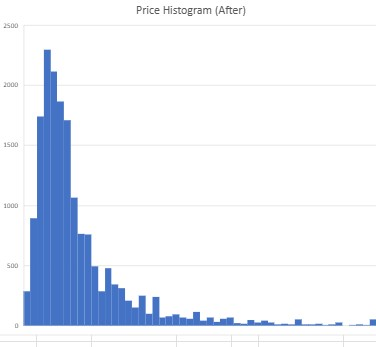

# Airbnb Listings Data Analysis

## Project Overview
This project involves analyzing Airbnb listings data to extract insights about pricing, location trends, host activity, and other factors influencing the Airbnb market. The dataset is processed, cleaned, and visualized to uncover key patterns.

## Dataset
The analysis is based on the Airbnb listings dataset, which contains information such as:
- Listing ID
- Host details
- Location (city, neighborhood, latitude, longitude)
- Price
- Room type
- Availability
- Number of reviews

## Objectives
- **Data Cleaning:** Handle missing values, correct data types, and filter relevant information.
- **Exploratory Data Analysis (EDA):** Identify trends in pricing, availability, and geographic distribution.
- **Visualization:** Create graphs and charts to present key insights.
- **Insights & Recommendations:** Provide findings that could help hosts optimize their listings.

## Technologies Used
- Python
- Pandas
- NumPy
- Matplotlib & Seaborn
- Jupyter Notebook

## Results
- Pricing trends by location
- Seasonal availability patterns
- Popular property types and host behaviors

## Visualizations
Below are some key visualizations from the analysis:

### Price Distribution by Location
.jpg)

### Price Histogram

### Room Type Distribution

